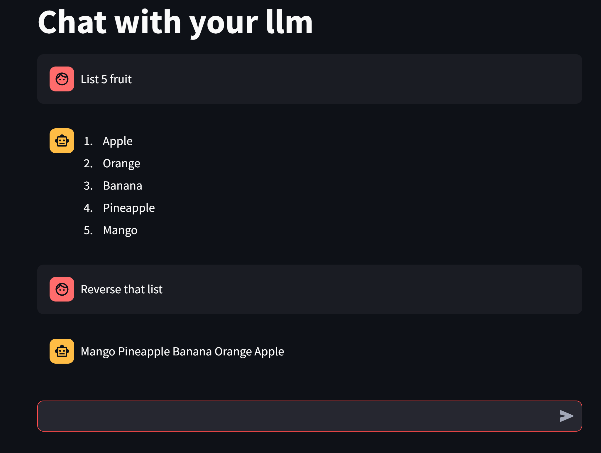

# streamlit_local_llm

Example streamlit UI to talk to a local llm (for instance run via lm studio)

# To install requirements

pip install -r requirements.txt

# To run LLM

Start lm studio (https://lmstudio.ai/) or similar

Load up your model, run inside local server

e.g. ```TheBloke/Mistral-7B-Instruct-v0.1-GGUF/mistral-7b-instruct-v0.1.Q3_K_L.gguf```

You can check to see it is working in the shell like this

```
curl http://localhost:1234/v1/chat/completions \
-H "Content-Type: application/json" \
-d '{ 
  "messages": [ 
    { "role": "system", "content": "Always answer in rhymes." },
    { "role": "user", "content": "Introduce yourself." }
  ], 
  "temperature": 0.7, 
  "max_tokens": -1  
}'
```

# To run UI

streamlit run main.py

It should launch the browser

Type in your query, it should talk to the local llm

e.g. ```list 5 fruit```

